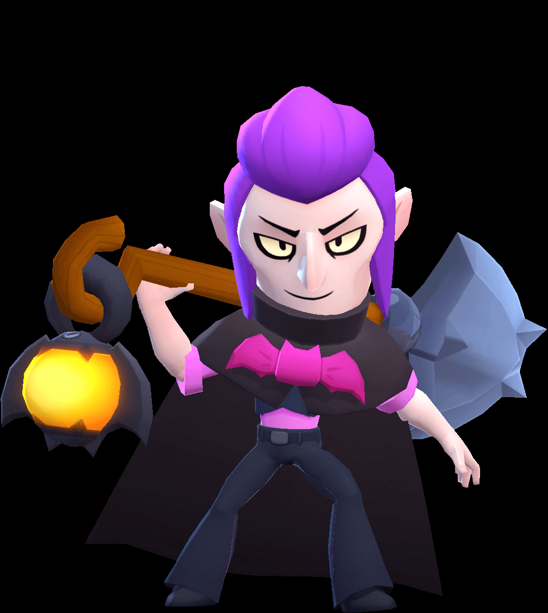

<HTML>
<head>
Brawl Stars operators
<link rel="stylesheet" href="stile.css">
</head>
<body>
<h1>Оперативники популярной игры Brawl Stars</h1>

<tr><td>
Коротоко об популярных персонажах в игре Brawl Stars
</td></tr>
  <table border='1' class="sport" ><tr>
<th rowspan="2">Статы</th>
<th rowspan="2"><a href=«https://yandex.ru/search/?text=%D1%88%D0%B5%D0%BB%D0%BB%D0%B8+%D0%B1%D1%80%D0%B0%D0%B2%D0%BB%D0%B5%D1%80+%D1%81%D1%82%D0%B0%D1%80%D1%81&clid=2411726&lr=24»>Шелли</a></th>
<th colspan="1">Базз</th>
<th rowspan="2">Мортис</th>
</tr>
<tr>

</tr>
<tr>
<td class="left">&#171;ХП&#187;</td>
<td></td>
<td>15</td>
<td>8</td>

</tr>
<tr>
<td class="left">&#171;Урон&#187;</td>
<td>12</td>
<td>15</td>
<td>3</td>

</tr>
<tr>
<td class="left">&#171;Супер&#187;</td>
<td>15</td>
<td>10</td>
<td>3</td>

</tr>
</table>

<table align="center">
<tr>
<th colspan = "3">
Модели персонажей
</th>
</tr>

<tr>
<td class = "picture"></a></td>
<td class = "picture">  </td>
<td class = "picture"></td>
</tr>
<tr>
<td><a href="table.html"> Шелли</td>     
<td class="note">Базз</td>
<td class="note">Мортис</td>
</tr>
</table>

<table>
</table>
</body>
</HTML>
